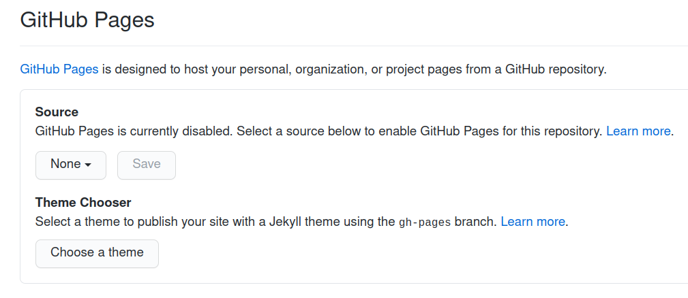

:::::::::::: questions

 - How do I get started?

::::::::::::::::::::::

::::::::::: objectives

- Create new lesson from scratch
- Identify the main command to preview the template
- Understand the basic structure of the new template

::::::::::::::::::::::


## Quickstart: Create a New Lesson

Let's say you have a set of R Markdown files that you used for a class website
that you want to convert into a Carpentries Lesson. To go from zero to a new 
lesson website that auto-renders R Markdown documents to a functional website is
three steps with `{sandpaper}`:

1. Create a site
2. Push to GitHub
3. Add your files

That's it. After that, if you know how to write in Markdown, you are good to go.

:::::::::::::::::: callout

### Takeaway message

Contributors should only be expected to know basic markdown and *very* minimal
yaml syntax in order to work on lessons.

:::::::::::::::::::::::::::

::::::::::::::::: challenge

### Try it yourself!

Follow these steps to create a brand new lesson on your Desktop.

1. Follow the [setup instructions](setup.html)
2. Open RStudio (or your preferred interface to R)
3. Use the following code:

```r
library("usethis")
library("sandpaper")

# Create a brand new lesson on your desktop called "buoyant-barnacle"
create_lesson("~/Desktop/buoyant-barnacle")
```

::::::::::: solution

If everything went correctly, you will now have a new RStudio window open to
your new project called "buoyant-barnacle" on your Desktop. 

You will notice that Buoyant Barnacle is initialized with a git repository by 
default.

::::::::::::::::::::
:::::::::::::::::::::::::::

## Previewing Your New Lesson

After you created your lesson, you will want to preview it locally. There is one
command to do that in [{sandpaper}]:


```r
sandpaper::build_lesson()
```

:::::::::::::: callout

### DID YOU KNOW? Keyboard Shortcuts are Available

If you are using RStudio, did you know you can use keyboard shortcuts to render
the lesson as you are working on the episodes?

Render and preview the whole lesson
:    <kbd>ctrl + shift + B</kbd>

Render and preview an episode
:    <kbd>ctrl + shift + K</kbd>
::::::::::::::::::::::

The first time you run this function, you might see A LOT of output on your
screen and then your browser will open the preview. If you run the command 
again, you will see much less output. If you like to would like to know how
everything works under the hood, you can check out the [{sandpaper} generator
chapter](sandpaper.html).

## Push to GitHub

The lesson you just created lives local on your computer, but still needs to go
to GitHub. At this point, we assume that you have successfully [linked your 
computer to GitHub](setup.html#connect-to-github-1).

1. visit <https://github.com/new/>
2. enter `buoyant-barnacle` as the repository name
3. Press the green "Create Repository" button at the bottom of the page
4. Follow the instructions on the page to push an existing repository from the
   command line. 

:::::::::::: callout

### One-step R solution

If you use R and use an HTTPS protocol, this can be done in a single step from
inside RStudio with the {usethis} package:

```r
usethis::use_github()
```

This function will set up a new repository under your personal account called
`buoyant-barnacle`, add that remote to your `git remotes`, and automatically
push your repository to GitHub. 

If you don't use the HTTPS protocol, and want to find out how to set it in R,
we have [a walkthrough to set your credentials in the learners section
](github-pat.html).

::::::::::::::::::::

A few minutes after you pushed your repository, the GitHub workflows would have
validated your lesson and created deployment branches. You can track the
progress at `https://github.com/<USERNAME>/buoyant-barnacle/actions/`. Once you
have a green check mark, you can [set up GitHub
Pages](https://docs.github.com/en/github/working-with-github-pages/configuring-a-publishing-source-for-your-github-pages-site)
by choosing `gh-pages` from the dropdown menu as shown in the image below:

{.image-with-shadow}

Click on the "select branch" button and select "gh-pages":

{.image-with-shadow}

> **Be patient!** GitHub needs to start up a new virtual machine the first time
> you use this, so it may take anywhere from 6 to 15 minutes for the workflow
> to run.

## Tools

As described in [the setup document](setup.html), the lesson template now only
requires R and [pandoc] to be installed. The tooling from the current lesson
template has been split up into three R packages:

1. [{varnish}] contains the HTML, CSS, and JavaScript elements
1. [{pegboard}] is a validator for the markdown documents
1. [{sandpaper}] is the engine that puts everything together. 

::::::::::::: keypoints

- Lessons can be created with `create_lesson()`
- Preview lessons with `build_lesson()`
- The toolchain is designed to be modular.

:::::::::::::::::::::::


<!-- Please do not delete anything below this line -->

[{varnish}]: template.html
[{pegboard}]: validator.html
[{sandpaper}]: engine.html


[cc-by-human]: https://creativecommons.org/licenses/by/4.0/
[cc-by-legal]: https://creativecommons.org/licenses/by/4.0/legalcode
[ci]: http://communityin.org/
[coc-reporting]: https://docs.carpentries.org/topic_folders/policies/incident-reporting.html
[coc]: https://docs.carpentries.org/topic_folders/policies/code-of-conduct.html
[concept-maps]: https://carpentries.github.io/instructor-training/05-memory/
[contrib-covenant]: https://contributor-covenant.org/
[contributing]: {{ repo_url }}/blob/{{ source_branch }}/CONTRIBUTING.md
[cran-checkpoint]: https://cran.r-project.org/package=checkpoint
[cran-knitr]: https://cran.r-project.org/package=knitr
[cran-stringr]: https://cran.r-project.org/package=stringr
[dc-lessons]: http://www.datacarpentry.org/lessons/
[email]: mailto:team@carpentries.org
[github-importer]: https://import.github.com/
[importer]: https://github.com/new/import
[jekyll-collection]: https://jekyllrb.com/docs/collections/
[jekyll-install]: https://jekyllrb.com/docs/installation/
[jekyll-windows]: http://jekyll-windows.juthilo.com/
[jekyll]: https://jekyllrb.com/
[jupyter]: https://jupyter.org/
[kramdown]: https://kramdown.gettalong.org/
[lc-lessons]: https://librarycarpentry.org/lessons/
[lesson-aio]: {{ relative_root_path }}
[lesson-coc]: {{ relative_root_path }}
[lesson-example]: https://carpentries.github.io/lesson-example/
[lesson-license]: {{ relative_root_path }}
[lesson-mainpage]: {{ relative_root_path }}
[lesson-reference]: {{ relative_root_path }}
[lesson-setup]: {{ relative_root_path }}
[mit-license]: https://opensource.org/licenses/mit-license.html
[morea]: https://morea-framework.github.io/
[numfocus]: https://numfocus.org/
[osi]: https://opensource.org
[pandoc]: https://pandoc.org/
[paper-now]: https://github.com/PeerJ/paper-now
[python-gapminder]: https://swcarpentry.github.io/python-novice-gapminder/
[pyyaml]: https://pypi.python.org/pypi/PyYAML
[r-markdown]: https://rmarkdown.rstudio.com/
[rstudio]: https://www.rstudio.com/
[ruby-install-guide]: https://www.ruby-lang.org/en/downloads/
[ruby-installer]: https://rubyinstaller.org/
[rubygems]: https://rubygems.org/pages/download/
[styles]: https://github.com/carpentries/styles/
[swc-lessons]: https://software-carpentry.org/lessons/
[swc-releases]: https://github.com/swcarpentry/swc-releases
[training]: https://carpentries.github.io/instructor-training/
[workshop-repo]: {{ site.workshop_repo }}
[yaml]: http://yaml.org/
